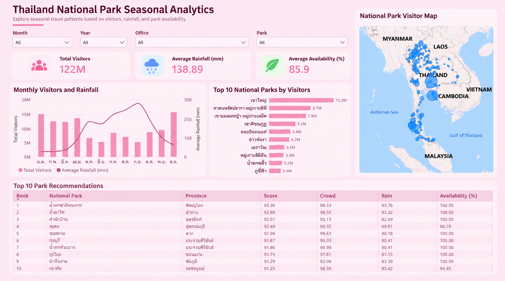

# Thailand National Park Seasonal Analytics

A data engineering and analytics project that integrates tourism, rainfall, and park availability data to analyze seasonal travel patterns and recommend suitable national parks for each month.

## Project Objective

This project aims to answer:

- Which national parks are suitable to visit during different months of the year based on rainfall, visitor volume, and park availability?

## Dashboard Preview



## Key Features

- Analyze national park visitor trends by month and year
- Compare visitor volume with average rainfall
- Explore national parks by location using an interactive map
- Filter data by month, year, conservation office, and national park
- Rank national parks using a seasonal suitability score
- Recommend suitable parks based on rainfall, crowd level, and park availability

## Data Sources

The project combines multiple datasets including:

- National park visitor statistics
- Monthly provincial rainfall data
- National park location and province mapping
- National park open/close information

## Data Pipeline

```text
Raw Data
   ↓
Data Cleaning
   ↓
Data Transformation
   ↓
Data Integration
   ↓
MySQL Database
   ↓
SQL Analytics
   ↓
Recommendation Scoring
   ↓
Power BI Dashboard